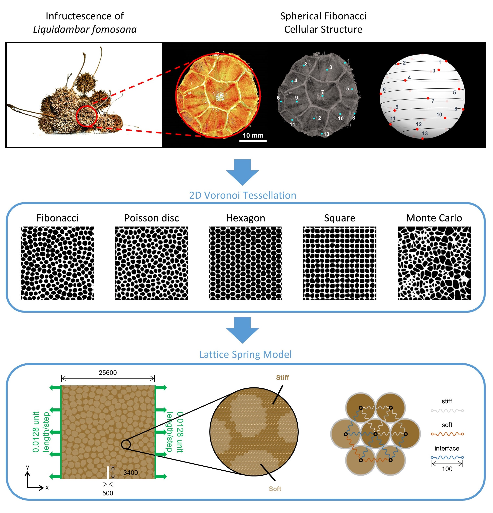

Cellular composites found in nature have provided fruitful inspirations for their exceptional toughness with merely a few building blocks of base constituents. The infructescence of Liquidambar formosana, which has porous cells arranged in spherical Fibonacci spirals, demonstrates high compressive stiffness and strength albeit lightweight and high porosity.
In this work, we propose a Fibonacci composite inspired by Liquidambar formosana. The stress-strain response and fracture modes of bio-inspired cellular composites are simulated to show that the structural geometry of stiff skeleton and soft inclusion governs the toughening performance of cellular composites. The Fibonacci composite outperforms other studied
geometries in terms of specific stiffening, strengthening, and toughening because of its high degree of isotropy to arrest and deflect the cracks across multiple length scales. ([Read paper for details](https://github.com/Chiang-Yuan/Portfolio/raw/master/content/publication/BioMGI_preprint_CS.pdf))

## Lattice Spring Model

Lattice Spring Model (LSM), one of the most common coarse-grained methods, is able to simulate the fracture of elastic body in good agreement with fracture mechanics and continuum theorem. The pair-wise potential energy between particles is usually described as harmonic spring snapping potential:

$$
\large
U(\eta) = \left\lbrace \begin{aligned}
& \frac{1}{2}k\left(\eta - \eta_0 \right)^2 & \eta \leq \eta_f \\
& 0 & \eta > \eta_f
\end{aligned}\right.
$$

<iframe src="https://www.youtube.com/embed/v9kyQaycz1o" width="880" height="495"></iframe>
