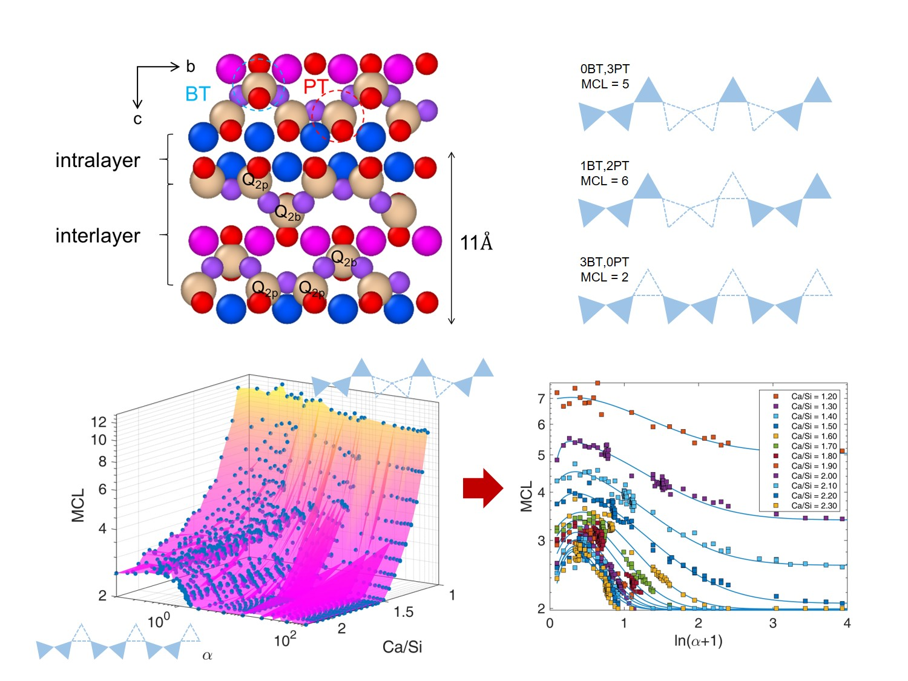

Produced at a quantity of four trillion tons per year, cement pastes is the second most-used material on the earth, except for water. The waste and carbon footprint accompanied with cement have posted a huge threat to the global sustainability. **Calcium-silicate-hydrates (C-S-H)**, accounting for 50-60% of bulk cement, is the major binding material responsible for holding aggregates together and providing strength of cement and even entire concrete structure.

In light of the recent engraving life expectancy of infrastructure, concrete structure calls for improvements in time-dependent properties such as creep and shrinkage. Therefore, understanding cement hydrates from nanometer scale has become crucial and urgent. With amorphous point defects in silicate network at nanometer scale, **C-S-H** has a wide range of atomistic configurations and shows polymorphic properties that are difficult characterize by current experimental approaches. The main focus of this study is to establish multiscale computational framework to quantitatively identify atomic and molecular structure of cement and concrete materials.

