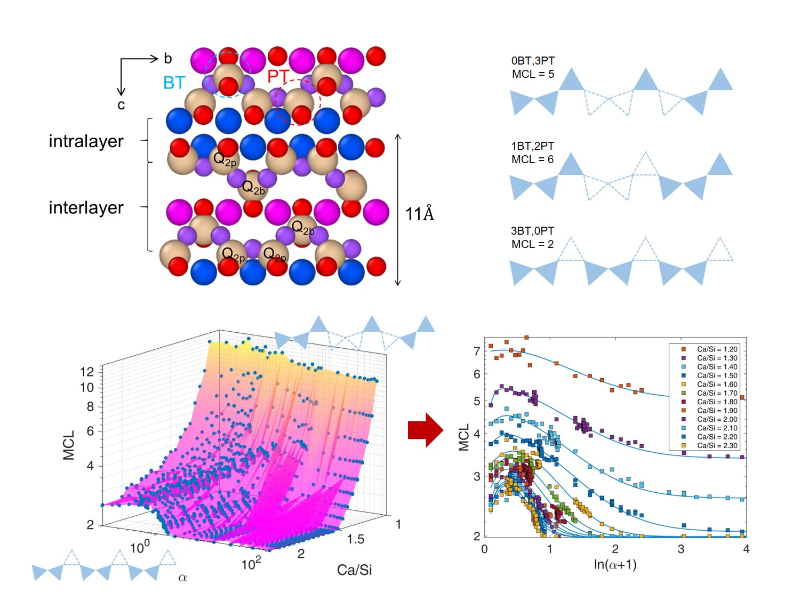

Produced at a quantity of trillion tons per year, cement pastes is the second most-used material on the earth, only second to water. The waste and carbon footprint accompanied by cement has posted a considerable threat to global sustainability. **Calcium-silicate-hydrates (C-S-H)**, accounting for 50-60% of bulk cement, is the primary binding material responsible for holding aggregates together and providing the strength of cement and concrete structure.

In light of the recent aggravating life expectancy of infrastructure, concrete structure calls for improvements from bottom-up in time-dependent properties such as creep and shrinkage. Therefore, understanding cement hydrates from the nanometer scale has become crucial and rising fields at the intersection of mechanics theorem and experiments. With amorphous point defects in silicate network at the nanometer scale, **C-S-H** has a wide range of atomistic configurations and shows polymorphic properties that are difficult to characterize by current experimental approaches. The main focus of this study is to establish multiscale computational framework to quantitatively identify atomic and molecular structural, mechanical, and physical attributes and variables of cement and concrete materials.

