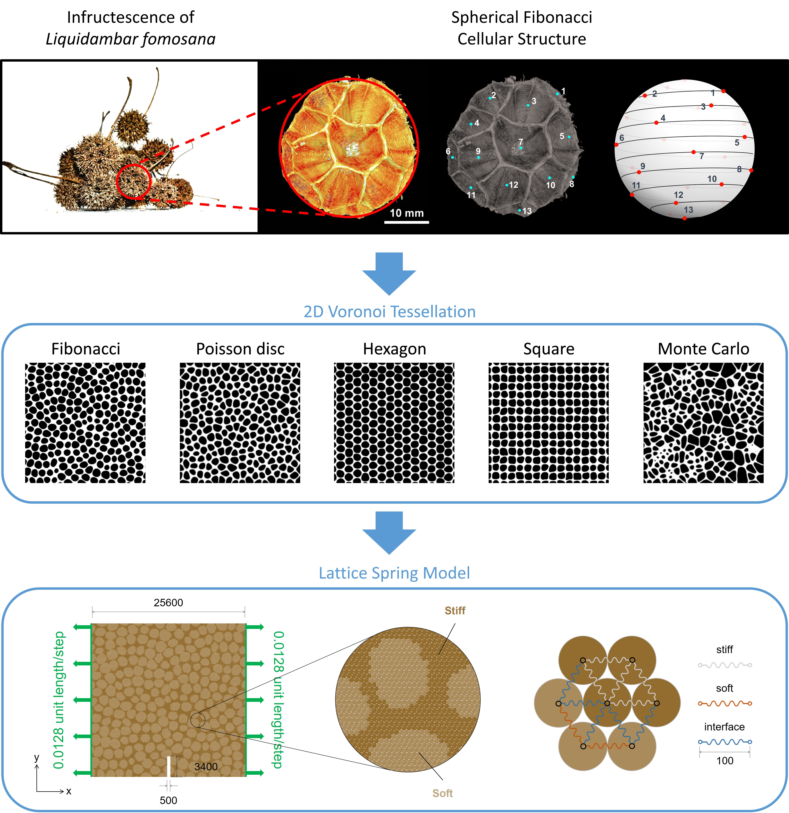

Cellular composites found in nature have provided fruitful inspirations for their exceptional
toughness with merely a few building blocks of base constituents. The infructescence of
Liquidambar formosana, which has porous cells arranged in spherical Fibonacci spirals,
demonstrates high compressive stiffness and strength albeit lightweight and high porosity.
In this work, we propose a Fibonacci composite inspired by Liquidambar formosana. The
stress-strain response and fracture modes of bio-inspired cellular composites are simulated to
show that the structural geometry of stiff skeleton and soft inclusion governs the toughening
performance of cellular composites. The Fibonacci composite outperforms other studied
geometries in terms of specific stiffening, strengthening, and toughening because of its high
degree of isotropy to arrest and deflect the cracks across multiple length scales. ([Read paper for details](https://github.com/Chiang-Yuan/Portfolio/raw/master/content/publication/BioMGI_preprint_CS.pdf))

