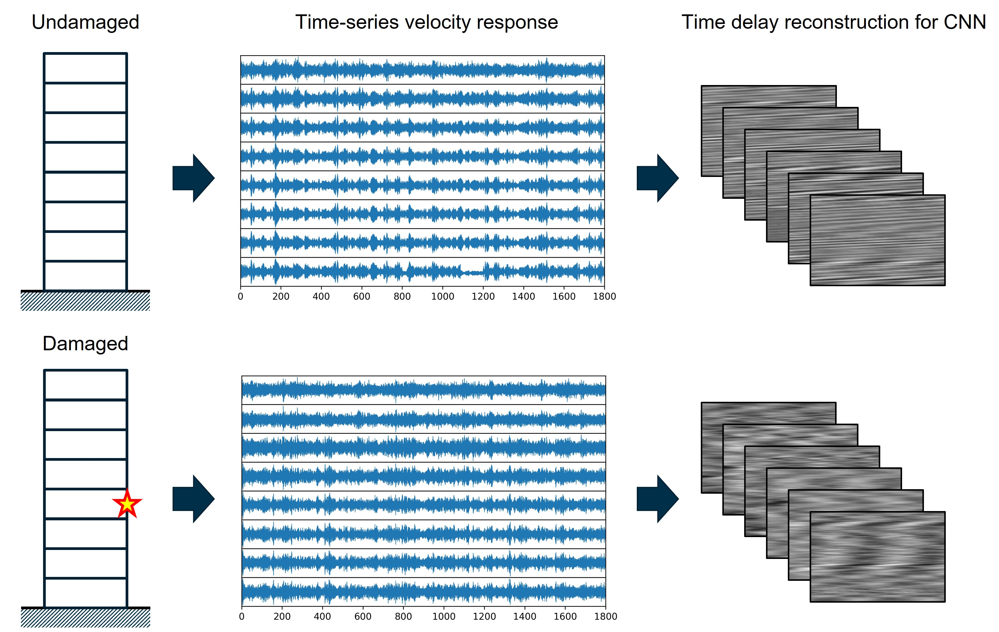

Detecting the damage location and severity is the essential process for structural health monitoring (SHM). Nondestructive, vibration-based testing has gathered increasing interests from structural, mechanical, and aerospace engineers over the decades. In this work, we adopt Takens' embedding theorem to develop time-delayed reconstruction framework to extract vibrational features from high-dimensional time series data. We show that the damage finger print of velocity response, which is difficult to directly obtain from ambient excitation, could be learned and classified by convolutional neural network.

